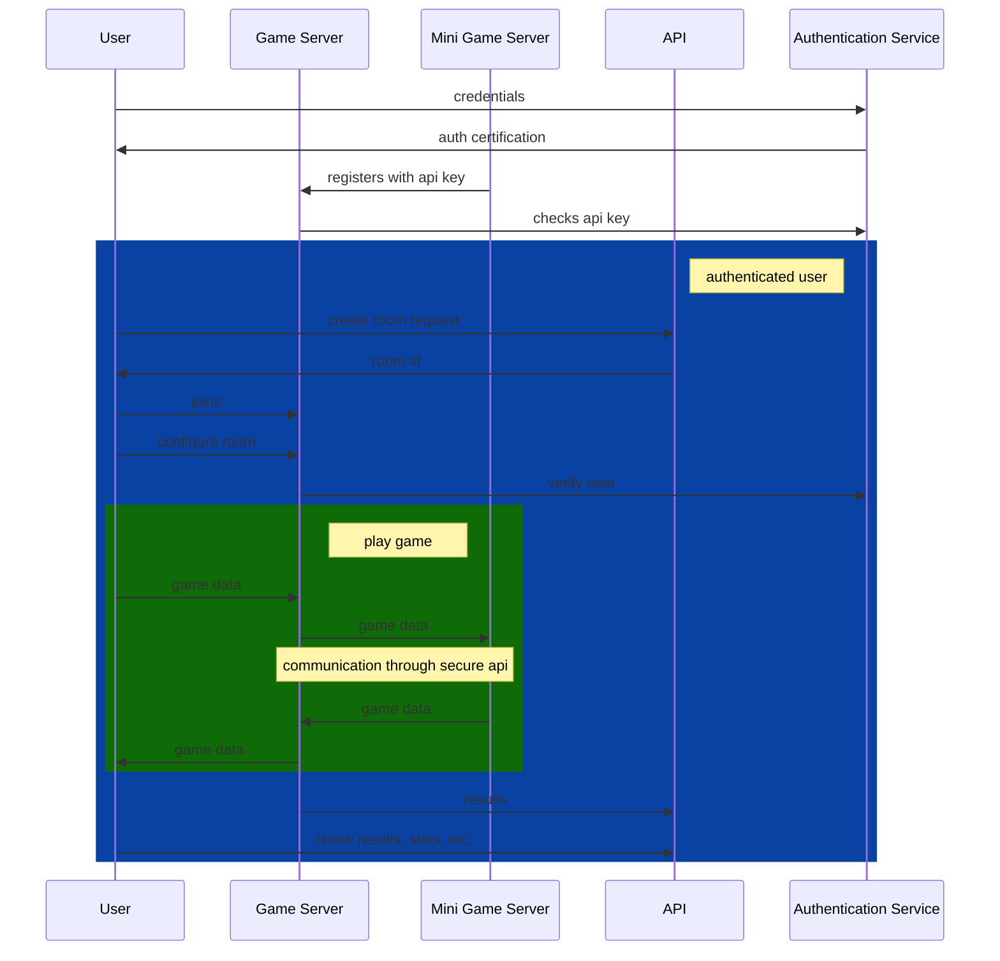

# General architecture

Here is a diagram explaining the general architecture of the project. The blue
part represents communications with authenticated users. The green part
represents the area where a game is played. For more details, continue reading
the paragraphs below.



## Modules in-depth description

### Authentication service

The authentication service does exactly what its name tells you, nothing more.
It is a key point to the project's security. It allows the user to
authenticate, and then prove his identity to the API service and the game
server.

```admonish info
OAuth 2.0 implementation would allow other external services like mini-games
servers to access user information in order to extend their functionality.
```

### API service

The API service manages general user data, like friends, game history, high
scores, added mini-games, etc. and it is also responsible for room creation. It
relies on the authentication service to identify the user.

### Game server

The game server is a real time socket server which communicates with the
different clients during the game. It is responsible for handling the main game
flow, and making contact between the mini-game server and the client. It is a
trusted, first party component. It also relies on the authentication service to
identify users. It interacts with the API service to create rooms, save scores,
etc.

### Mini-games servers

A mini-game server is a real time socket server that implements a mini-game. It
can either be a first party server, or a third party, self-hosted server. To
ensure security, communication between this and the client is done through the
game server, using a secure and well-defined API.

### Client

The client used by the user to play games is a website. The website uses the
authentication service to get access to a token which will identify itself to
other services. It mainly interacts with the API service for viewing and
updating personal data, or creating a room. It communicates with the game
server during the game to send user actions and receive game information.

## Reasoning

First of all, we need to establish the goals we are trying to achieve :

- Ease of implementation
- Modularity (for plug in mini games)
- Security (mini games should not be able to be a point of attack, no matter what)
- Functionality (mini games should not be limited in any way, or at least to be the least limited possible)

Ease of implementation is obvious, do not make it hard if it does not have to
be. Modularity is a must as well : mini-games should be able to be added,
removed, updated without need to touch the project's code. They should be able
to run on other servers, even community servers (self hosted). This means
security has to be very well thought out, since some people might try to create
malicious mini-game servers. The implementation should also not limit the
functionality of mini-games.

This implementation allows for a very great combination of all of the above.
Modularity is respected. Mini-game servers are run on any machine,
authenticated through the authentication service, and plugged in to the game
server. The IP's of the mini-game servers should be stored in a database, and
the authentication service should provide them with API keys, which they will
use to authenticate themselves to other services. This also allows the
mini-game servers to be implemented in any language, leaving the door open to
all developers.

Security is implemented through the game server <-> mini-game server API. The
latter is not yet defined, but it's structure will only allow it to do basic,
game related actions, and not access user data or any other kind of sensitive
endpoint/data.

Functionality is defined through the API as well. That's why it has to be as
open and extensible as possible, while remaining secure.
