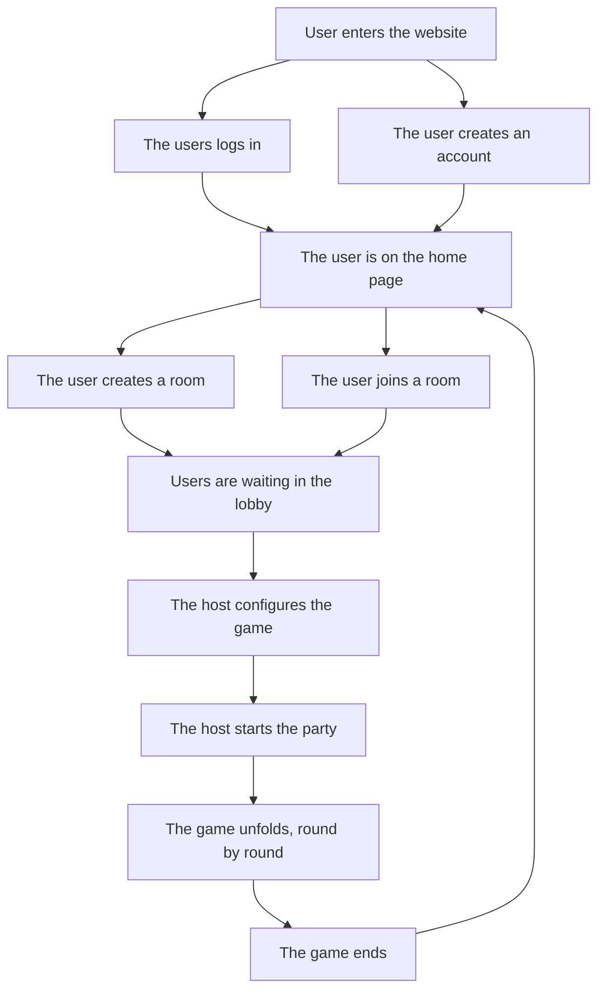

# Description

This part of the book focuses on documenting the project's features.

## Brief description

CRBl_ Studio Games is an open source, collaborative and extensible mini-games
server and web interface. It's supposed to be a place of joy and fun built for
friends, built by friends with joy and fun.

The main feature of the project is playing games, composed of configurable
rounds. Each round is a mini-game. Mini-games are short, 1-2 minutes games,
which return an amount of points at the end. At the end of the game, each
player's score is composed of the sum of all the scores he did during each
round. The player with the highest score wins.

## User experience

Here is a graphical representation of how the user should interact with the
website. For more details, read the extended description below.



### Joining the website

The first thing the user do is joining the website. On the landing page, the
users has the choice between registering or logging in, as well as a nice
preview of what the project is. Registering is as simple as providing a
username, an email address and a password. After verifying his email, the user
can connect to the website and start using it.

### Room and lobby

Once the player has an account, he's ready to start playing. Creating a room is
as simple as clicking a button. This will redirect the player to a room, and
create a shareable link to the room he can share with friends, or directly
invite friends from his friends list. While waiting for everyone to join and
get ready, the host (the person who created the room) will be able to configure
the lobby (or select some predefined game configurations). During this
phase, the host can add rounds, select what mini-game to play each round, and
configure some mini-games details.

### Game phase

During the game phase, the players are focused on the game. They can
communicate through an in game chat, but it would be preferable for them to be
in a call. Each round will get played one after the other, with small pauses in
between. An ability to vote for a pause will allow players to pause the game in
case an emergency intervenes.

### Game end

At the end of the game, there is a recap of each round and a leader board
displaying who won, and some fun statistics about each player. Afterwards, the
players are dropped back in the lobby, where the cycle begins once again.

## Extensions

```admonish info
This part is subject to change, and some extensions below might get their
dedicated chapters in the future, if they get into development.
```

Here is a list of extensions ideas. These are just ideas, but it would be great
to plan the project in a way to leave room for easy implementation of these :

- Friend list, with easy messaging and invites
- Mini-games marketplace
- Mumble plugin
- Global leader boards, with high scores
- Achievements
