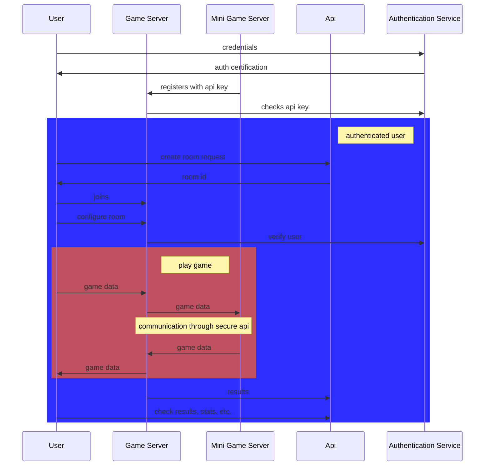

# General architecture of the project

## Reasoning

First of all, we need to establish the goals we are trying to achieve :

- Ease of implementation
- Modularity (for plug in mini games)
- Security (mini games should not be able to be a point of attack, no matter what)
- Functionality (mini games should not be limited in any way, or at least to be the least limited possible)

Ease of implementation is obvious, do not make it hard if it does not have to
be. Modularity is a must as well : mini games should be able to be added,
removed, updated without need to touch the project's code. They should be able
to run on other servers, even community servers (self hosted). This means
security has to be very well thought out, since some people might try to create
malicious mini games servers. The implementation should also not limit the
functionality of mini games.

This implementation allows for a very great combination of all of the above.
Modularity is respected. Mini game servers are run on any machine,
authenticated through the authentication service, and plugged in to the game
server. The IP's of the mini games servers should be stored in a database, and
the authentication service should provide them with API keys, which they will
use to authenticate themselves to other services. This also allows the mini
games servers to be implemented in any language, leaving the door open to all
developers.

Security is implemented through the game server <-> mini game server API. The
latter is not yet defined, but it's structure will only allow it to do basic,
game related actions, and not access user data or any other kind of sensitive
endpoint/data.

Functionality is defined through the API as well. That's why it has to be as
open and extensible as possible, while remaining secure.
